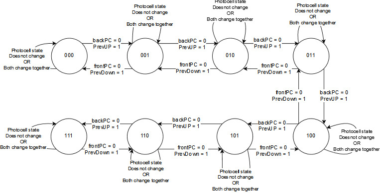

# Queue Manager
A system to monitor the client queue in front of the tellers. 
It displays various information about the status of the queue.
- Number of clients standing in front of the queue.
- Expected Waiting time for the client.
- Automatically detect the entering and leaving clients. 

##### SBqM : safe bank queue manager

## Detailed specification:
- Both queue ends are equipped with a photocell. Each photocell generates a logic ‘1’ signal if nobody interrupts a light beam generated at the corresponding queue end. When the light beam is interrupted, the photocell output changes to logic ‘0’ and stays at that value until it is no longer interrupted.
- Clients are supposed to enter the queue only from the back end and leaves only from the front end.
- The number of people standing in the queue (waiting to be served by a teller), Pcount, and the expected waiting time in the queue before being served, Wtime, are to be displayed.
- Pcount is to be incremented by only one when a client enters the queue and is to be decremented by only one when a client leaves even if a client stands in front of the light beam for a long time period.
- Wtime, in seconds, could approximately be given by the formulas: 
> Wtime (Pcount = 0) = 0, 
> Wtime (Pcount  0,Tcount) = 3*(Pcount+Tcount-1)/Tcount

where Tcount is the number of tellers currently in service (Tcount > {1,2,3}) and Wtime is rounded by ignoring the fraction part.
- SBqM™ maintains binary empty and full flags that reflect the status of the queue.
- A responsible person should have the capability of resetting the system. Resetting the system clears the full flag and Pcount, and the sets empty flag

## Design 
- Internal clock is used to drive the system 
- An FSM counter that waits for the negedge of the photocells to increase or decrease number of clients -limit 7 clients-.

- Full/empty flags are used to determine whether  the queue is full or empty.
- Wtime is calculated manually and loaded from a ROM 
- A display is used to display number of people waiting and waiting time for them - for simulation only -
- It's divided into four modules {  Main module [sBqm](src/sBqm.v) - [counter](src/counter.v) - [flags](src/flags.v) - [ROM](src/ROM.v)]

## Language
- Verilog
