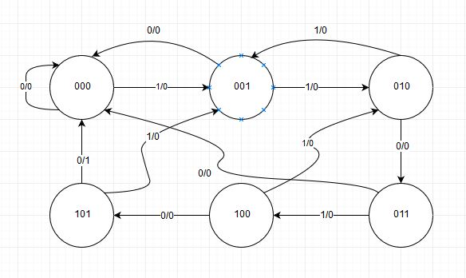

# Sequence Detector
Detects a sequence of “110100” without any overlapping using FSM algorithm.

## Design:
- The device will have input signal DATA_IN of only one bit that accept the input bit stream in addition to the system clock and only one bit output SEQ_FOUND that asserted to be one with the last bit of the found sequence for one clock cycle and returns back to zero waiting for the following sequence.
- It's based on Mealy machine FSM 

## Language
- Verilog
