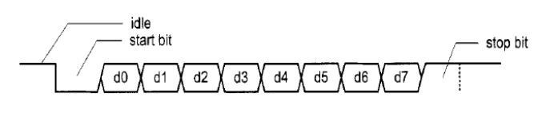

# UART
Universal asynchronous receiver-transmitter is a circuit that sends parallel data through a serial line.

## Detailed specification:
- A UART includes transmitter and receiver and a baud rate generator. 
- The baud rate generator generates a sampling signal whose frequency is exactly 16 times the UART transmitter baud rate.
- The input -parallel- data is sent to the transmitter every 15 minutes. 
- The transmitter is a shift register that loads the data in parallel and then shifts it out bit by bit at a specific rate. - 
- The receiver on the other hand, shifts in data bit by bit and then reassembles the data.
- The serial line is '1' when it is idle.
- The transmission starts with a start bit, which is '0', followed by data bits and an optional parity bit, and ends with stop bits, which are '1'.
- The number of data bits can be 7 or 8.
- The optional parity bit is used for error detection.
-- For odd parity it's set to '0' when the data bits have an odd number of 1's
-- For even parity it's set to '0' when the data bits have an even number of 1's
- The number of stop bits can be 1 or 2.

## Design 
- A baud rate generator drives a clock from the main system internal clock (50 MHZ) 
-- The clock is generated depending on a 2-bit input signal that specifies the baud rate, which  can be 1200,2400,4800 or 9600.
-- A time watch is created from the main system clock to calculate seconds,minutes,hours,days,monthes
- The number of input data bits is specified using a 1-bit signal 'd_num', which can be 7 or 8.
- The parity scheme is specified using a 2-bit signal 'par', which can be no parity, odd parity or even parity.
- A 3-bit output 'err' signal is used to indicate the error in transferring data 'parity error, frame error and data overrun error.

## TestBench 
There are two different type of [testbench](testbench) here.
- Testbench for the whole uart called [uart_TB](testbench/uart_TB.v). 
- Testbench for every module [receiver_TB](testbench/receiver_TB.v) and [transmitter_TB](testbench/transmitter_TB.v).

## Language
- Verilog
